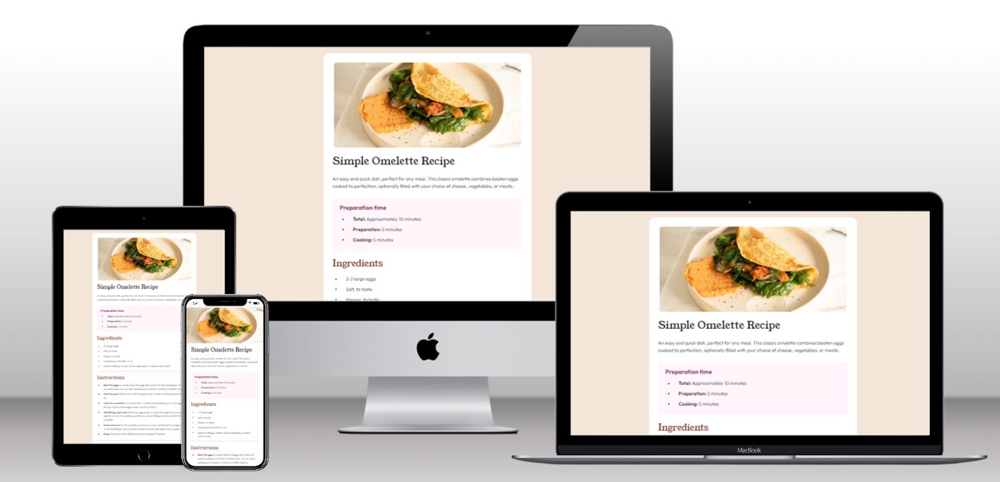

# Frontend Mentor - Recipe page solution

This is a solution to the [Recipe page challenge on Frontend Mentor](https://www.frontendmentor.io/challenges/recipe-page-KiTsR8QQKm). Frontend Mentor challenges help you improve your coding skills by building realistic projects. 

## Table of contents

- [Overview](#overview)
  - [Screenshot](#screenshot)
  - [Links](#links)
- [My process](#my-process)
  - [Built with](#built-with)
  - [What I learned](#what-i-learned)
  - [Useful resources](#useful-resources)
- [Author](#author)

**Note: Delete this note and update the table of contents based on what sections you keep.**

## Overview

### Screenshot

### Links

- Solution URL: https://github.com/leonp84/fm3-recipe-page
- Live Site URL: https://leonp84.github.io/fm3-recipe-page/

## My process

### Built with

- Semantic HTML5 markup
- CSS custom properties
- Flexbox
- Mobile-first workflow

### What I learned

Ordered and Unordered list can be complicated to margin and pad properly. Centering the display items of list (vertically aligned with the text) is not easy with plain CSS.

### Useful resources

- [ChatGPT](https://chat.openai.com/) - Incredibly helpful for answering detailed question about obscure CSS syntax.

## Author

- Website - [Leon Potgieter (Github)](https://github.com/leonp84)
- Frontend Mentor - [@leonp84](https://www.frontendmentor.io/profile/leonp84)